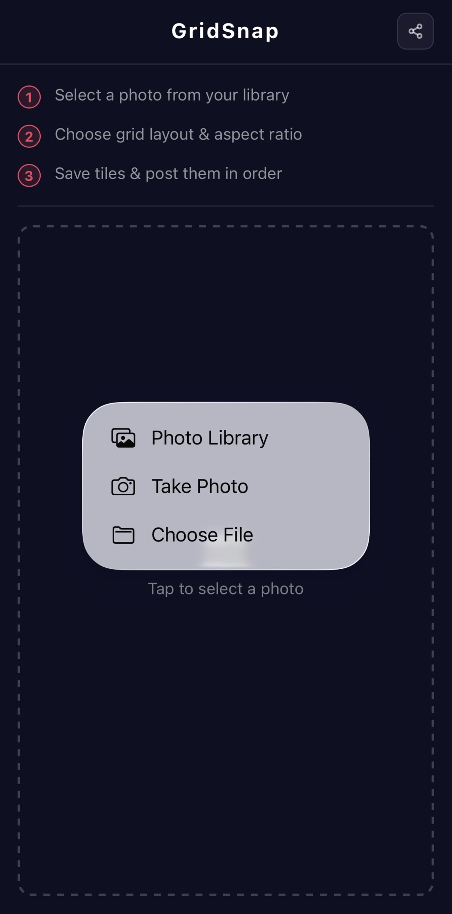
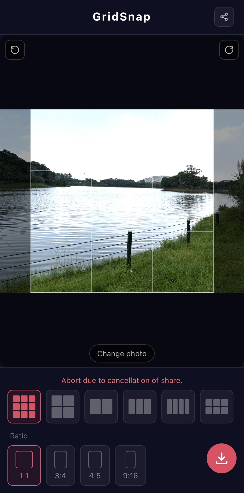

# GridSnap

[](https://github.com/Kingson4Wu/GridSnap/actions/workflows/deploy.yml)
[](LICENSE)

Split a photo into a grid for posting to Instagram and other social media. Supports 3×3, 2×2, panoramic strips, and more. Works directly in your mobile browser — no app install needed.

**Live demo:** https://kingson4wu.github.io/GridSnap/

<p align="center">
  
  &nbsp;&nbsp;
  
</p>

---

## Features

- **6 grid layouts** — 3×3, 2×2, 2×3, 1×2, 1×3, 1×4
- **4 aspect ratios** — 1:1, 3:4, 4:5, 9:16
- **Rotate** — 90° CW / CCW before cropping
- **Pinch-to-zoom & drag** to reposition the crop
- **1080px tiles** — matches Instagram's recommended resolution
- **Offline-ready PWA** — install to home screen, works without internet
- **Privacy-first** — everything runs in the browser; photos are never uploaded
- **Share** — share the app link to X, WhatsApp, Telegram, or copy URL

---

## How to Use

### iOS (iPhone / iPad)

1. Open https://kingson4wu.github.io/GridSnap/ in **Safari**
2. Tap the Share button → **"Add to Home Screen"** to install (works offline)
3. Tap "Select Image" → choose a photo from your library
4. Choose a grid layout and aspect ratio
5. Pinch to zoom or drag to reposition; use the rotation buttons if needed
6. Tap the save button — choose "Save to Files" or "Save Image"

> Use Safari. Chrome/Firefox on iOS do not support PWA installation.

### Android

1. Open https://kingson4wu.github.io/GridSnap/ in **Chrome**
2. Tap the menu → **"Install app"** (or accept the banner)
3. Select image → adjust crop → save. Images download to your Downloads folder.

### Desktop

Open in any browser. "Save" downloads all tiles to your computer.

---

## Grid Layouts

| Layout | Tiles | Best for |
|--------|-------|----------|
| 3×3    | 9     | Classic 9-panel Instagram grid |
| 2×2    | 4     | 4-panel square grid |
| 2×3    | 6     | 6-panel portrait grid |
| 1×2    | 2     | Side-by-side panorama |
| 1×3    | 3     | Horizontal 3-tile strip |
| 1×4    | 4     | Horizontal 4-tile strip |

**Aspect ratios per cell:** 1:1 · 3:4 · 4:5 · 9:16

---

## Tips

- Set your aspect ratio before adjusting the crop — changing it resets the composition
- On Instagram, upload tiles in order; viewers swipe left to see the full image
- Use the rotate buttons (top-left / top-right of the crop area) to fix orientation

---

## Development

**Requirements:** Node.js ≥ 20

```bash
git clone https://github.com/Kingson4Wu/GridSnap.git
cd GridSnap
npm install
npm run dev
```

Open `http://localhost:5173/GridSnap/`.

| Command | Description |
|---------|-------------|
| `npm run dev` | Start dev server with HMR |
| `npm test` | Run unit tests (Vitest) |
| `npm run e2e` | Run E2E tests (Playwright) |
| `npm run build` | Production build |
| `npm run lint` | Lint source files |

**Tech stack:** React 18 · TypeScript · Vite · Tailwind CSS · react-easy-crop · vite-plugin-pwa

---

## Contributing

See [CONTRIBUTING.md](CONTRIBUTING.md). Bug reports and feature requests are welcome via [GitHub Issues](https://github.com/Kingson4Wu/GridSnap/issues).

---

## License

[MIT](LICENSE) © Kingson Wu
