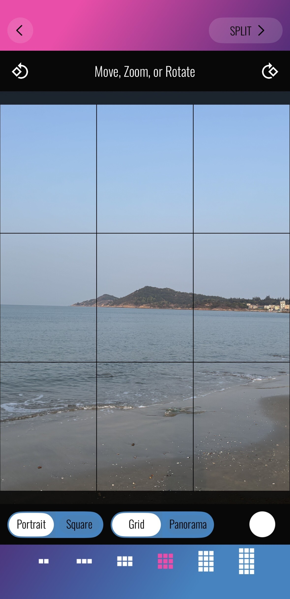

# I Built a Free PhotoSplit Alternative in Two Hours Without Writing a Single Line of Code

Last week I wanted to split a photo into a 9-panel grid for Instagram. I opened PhotoSplit, saw the subscription prompt, and closed it.

I didn't pay. I opened a terminal instead.

Two hours later I had a fully working replacement: six grid layouts, four aspect ratios, rotation, offline PWA install, 33 automated tests, GitHub Actions CI/CD, and complete open-source documentation.

**I wrote zero lines of code.**

---

## The Setup

PhotoSplit is a popular iOS tool for splitting one large photo into a 3×3 grid of 9 tiles. Post them in order to Instagram and viewers swipe left to see the whole image. Useful, well-made — but paid.

I used to have two options: pay up, or spend a few days writing my own. Now there's a third: **describe what you want, and wait for the AI to build it.**

---

## Three Tools

**Claude Code** is Anthropic's CLI tool that runs directly in your terminal. It doesn't just "help you write code" — it reads files, runs commands, executes tests, fixes bugs, commits, and pushes. It participates in the full development loop without any copy-pasting.

**Superpowers Skills** is a structured workflow plugin for Claude Code. It breaks development into phases: requirements discussion, implementation planning, execution. The key pattern is Subagent-Driven Development — each task is handled by a fresh subagent, which then triggers two rounds of automated review: first checking spec compliance, then code quality. If either review fails, it's sent back for fixes. I don't watch the screen. It writes, tests, reviews, and commits on its own.

**gh CLI** is GitHub's official command-line tool. Create releases, set topics, write wiki pages, manage labels, enable discussions — all without opening a browser.

---

## Four Moments That Mattered

### 1. One sentence to start: `/brainstorming`

I typed: "Build a web app that splits a photo into a grid, supports different aspect ratios, for posting to Instagram."

Then a conversation. The AI asked: should it support grids beyond 3×3? How should the output be saved — download or share? Should it support multiple languages? A few exchanges later, it produced a complete design doc: tech stack (React 18 + TypeScript + Tailwind CSS + Vite), component structure, state management approach, i18n strategy, PWA configuration.

I didn't write anything. I just answered questions.

### 2. Task breakdown: `/writing-plans`

Once the design was confirmed, the AI broke it into an implementation plan. Not vague "implement X feature" items — each task specified exactly which files to create or modify, what tests to write first (TDD), what implementation code follows the tests, which command to run to verify, and what the commit message should be. Each task ran about 5–10 steps, down to the level of "run test → confirm FAIL → write implementation → confirm PASS → commit."

### 3. Waiting

After launching Subagent-Driven Development, I mostly just watched.

The screen was scrolling. Subagents were writing code, running tests, self-reviewing, fixing issues, reviewing again. Occasionally one would ask me a question: "When the Copy Link button is clicked and shows 'Copied!', how many seconds before it resets?" I said "2 seconds." It kept going.

Final result: 7 test files, 33 tests, all green. Build passed, deployed to GitHub Pages.

### 4. GitHub, all at once

When the features were done, I told Claude Code: "Make this GitHub repository look professional."

Then I watched it call `gh repo edit` to update the description and add topics like `pwa`, `instagram`, `react`; call `gh release create` to publish v1.0.0 with auto-generated release notes; call the GitHub API to enable Discussions, disable merge commits (squash only), and auto-delete branches after merge; clone the wiki repo and push five pages — Home, User Guide, Architecture, Contributing, Roadmap; create issue labels for `ios`, `android`, `pwa`, `ui/ux`.

I never opened GitHub in a browser. The one thing I did manually: upload the Social Preview image — GitHub doesn't expose that via API.

---

## How It Stacks Up Against PhotoSplit

| Feature | PhotoSplit | GridSnap |
|---------|-----------|---------|
| 3×3 grid | ✅ | ✅ |
| Other grid sizes | Partial | ✅ 6 layouts |
| Multiple aspect ratios | ✅ | ✅ 4 options |
| Rotation | ✅ | ✅ |
| Pinch-to-zoom crop | ✅ | ✅ |
| Offline / installable PWA | ❌ | ✅ |
| Photos stay on device | ✅ | ✅ |
| Free | ❌ Subscription | ✅ MIT |
| Android & desktop | ❌ iOS only | ✅ |

PhotoSplit has an edge as a native app. But for splitting a photo and downloading the tiles, GridSnap covers everything — and works on any device. On iOS, open it in Safari, tap Share → "Add to Home Screen", and it installs like a regular app, works offline included.

**Live demo:** https://kingson4wu.github.io/GridSnap/
**GitHub:** https://github.com/Kingson4Wu/GridSnap

---

## What This Actually Means

"AI makes coding faster" — I've heard that line a hundred times. It's a programmer's framing: same code, less time.

This was different. I didn't use AI to code faster. I didn't code at all. Everything I did was: state requirements, answer questions, confirm direction. Whether you know React, TypeScript, or what a PWA is doesn't change the outcome.

Technical knowledge still helps — it lets you ask better questions and catch it when the AI goes off track. But the floor has dropped.

An idea that used to die on the idea stage can now become an open-source project on GitHub Pages in two hours. That shift feels more interesting than "coding faster."

---

## Screenshots

**PhotoSplit (paid):**

**GridSnap (free, open source):**

  
  &nbsp;
  

